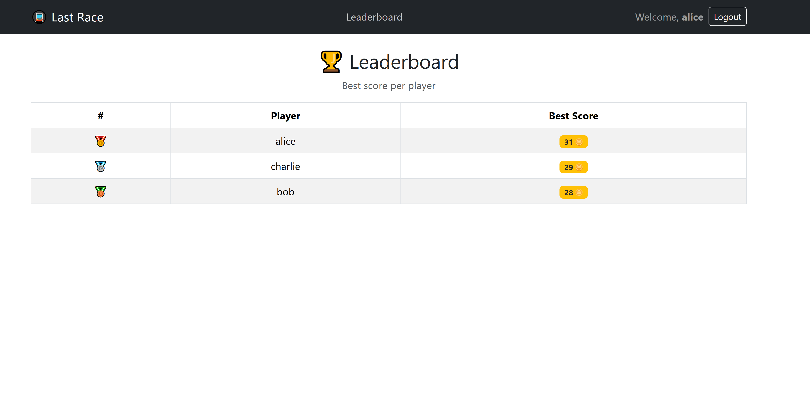
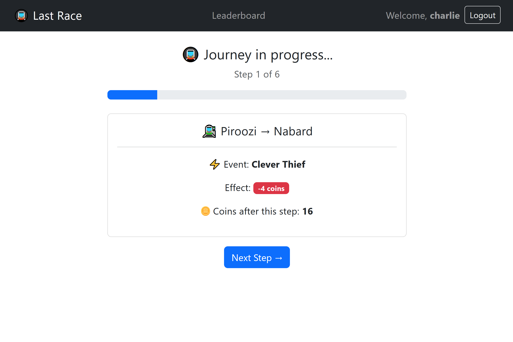
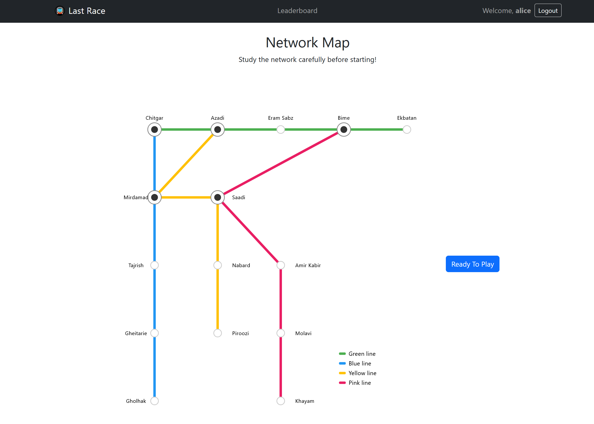
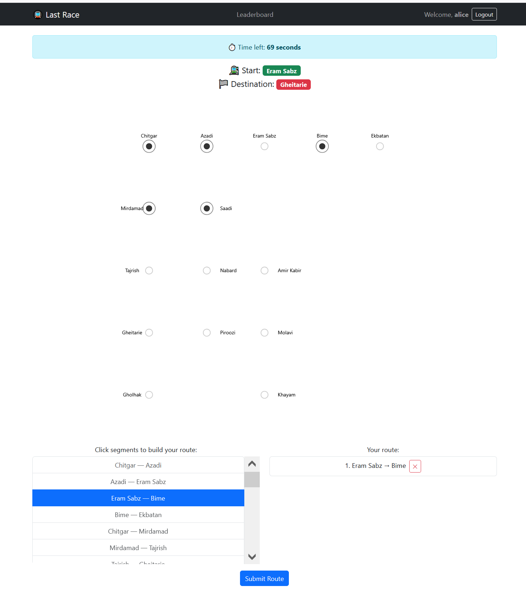

# Exam #1: "Last Race"

## Student: s355079 Mosaferi Kimia

## React Client Application Routes

- Route `/`: instructions page, visible to all users including anonymous
- Route `/login`: login form page
- Route `/game/setup`: phase 1 — shows full network map with all lines and stations, logged-in only
- Route `/game/planning`: phase 2 — 90 second timer, segment list, route building, logged-in only
- Route `/game/execution`: phase 3 — step by step display of events and coin updates, logged-in only
- Route `/game/result`: phase 4 — final score display and option to play again, logged-in only
- Route `/leaderboard`: general ranking page showing best score per user, logged-in only

## API Server

### Authentication

#### `POST /api/sessions`

- Request body: `{ "username": "alice", "password": "1234" }`
- Response body: `{ "id": 1, "username": "alice" }`
- Status codes: `200 OK`, `401 Unauthorized`

#### `GET /api/sessions/current`

- Request parameters: none
- Response body: `{ "id": 1, "username": "alice" }`
- Status codes: `200 OK`, `401 Unauthorized`

#### `DELETE /api/sessions/current`

- Request parameters: none
- Response body: none
- Status codes: `200 OK`, `401 Unauthorized`

### Network

#### `GET /api/network`

- Auth: required
- Request parameters: none
- Response body:

```json
[
  {
    "id": 1,
    "name": "Chitgar",
    "line_id": 1,
    "line_name": "Green",
    "position": 1
  },
  {
    "id": 2,
    "name": "Azadi",
    "line_id": 1,
    "line_name": "Green",
    "position": 2
  }
]
```

- Status codes: `200 OK`, `401 Unauthorized`, `500 Internal Server Error`

#### `GET /api/network/segments`

- Auth: required
- Request parameters: none
- Response body:

```json
[
  {
    "from_id": 1,
    "from_station": "Chitgar",
    "to_id": 2,
    "to_station": "Azadi",
    "line_id": 1,
    "line_name": "Green"
  }
]
```

- Status codes: `200 OK`, `401 Unauthorized`, `500 Internal Server Error`

### Game

#### `GET /api/game/start`

- Auth: required
- Request parameters: none
- Response body: `{ "startId": 1, "endId": 10 }`
- Status codes: `200 OK`, `401 Unauthorized`, `500 Internal Server Error`

#### `POST /api/game/submit`

- Auth: required
- Request body:

```json
{
  "startId": 1,
  "endId": 10,
  "segments": [
    { "fromId": 1, "toId": 2 },
    { "fromId": 2, "toId": 6 },
    { "fromId": 6, "toId": 10 }
  ]
}
```

- Response body (valid route):

```json
{
  "valid": true,
  "score": 18,
  "steps": [
    {
      "fromId": 1,
      "toId": 2,
      "event": "Serene Passage",
      "effect": 0,
      "coinsAfter": 20
    },
    {
      "fromId": 2,
      "toId": 6,
      "event": "Mistaken Departure",
      "effect": -2,
      "coinsAfter": 18
    }
  ]
}
```

- Response body (invalid route): `{ "valid": false, "score": 0, "steps": [] }`
- Status codes: `200 OK`, `401 Unauthorized`, `422 Unprocessable Entity`, `500 Internal Server Error`

#### `GET /api/leaderboard`

- Auth: required
- Request parameters: none
- Response body:

```json
[
  { "username": "alice", "best_score": 18 },
  { "username": "bob", "best_score": 12 }
]
```

- Status codes: `200 OK`, `401 Unauthorized`, `500 Internal Server Error`

## Database Tables

- Table `stations` - contains all metro stations (id, name)
- Table `lines` - contains all metro lines (id, name)
- Table `line_stations` - maps stations to lines with their position order (line_id, station_id, position)
- Table `events` - contains random events with their coin effects (id, description, effect)
- Table `users` - contains registered users with encrypted credentials (id, username, hash, salt)
- Table `games` - contains completed games with scores (id, user_id, start_station_id, end_station_id, score, started_at)
- Table `game_segments` - contains each step of a game with the event that occurred (id, game_id, step_order, from_station_id, to_station_id, event_id, coins_after)

## Main React Components

- `App` (in `App.jsx`): root component, manages user authentication state, game state (gameData, result), and defines all client-side routes with protection for logged-in users
- `Header` (in `components/Header.jsx`): navigation bar showing app title, leaderboard link, username and logout button when logged in, login button when anonymous
- `NetworkMap` (in `components/NetworkMap.jsx`): SVG/CSS metro map showing all stations and lines; accepts `showLines` prop — when true shows full map with colored lines (setup phase), when false shows only station dots (planning phase)
- `InstructionsPage` (in `pages/InstructionsPage.jsx`): landing page visible to all users, shows game rules and a Play button (logged-in) or Login to Play button (anonymous)
- `LoginPage` (in `pages/LoginPage.jsx`): login form with username and password fields, handles authentication and redirects to home on success
- `SetupPage` (in `pages/SetupPage.jsx`): shows full network map with all lines and stations, player clicks Ready to Play to fetch random start/destination and proceed to planning
- `PlanningPage` (in `pages/PlanningPage.jsx`): shows 90 second countdown timer, station-only map, scrollable segment list to build route by clicking, selected route displayed in order, auto-submits when timer expires
- `ExecutionPage` (in `pages/ExecutionPage.jsx`): shows journey steps one at a time with station names, random event, coin effect, and running coin total; Next button advances steps, final step shows See Result button
- `ResultPage` (in `pages/ResultPage.jsx`): displays final coin score, shows whether route was valid or invalid, offers Play Again and Leaderboard buttons
- `LeaderboardPage` (in `pages/LeaderboardPage.jsx`): fetches and displays best score per registered user in a ranked table with medal emojis for top 3

## Screenshots

### Leaderboard Page



### Game Execution Phase



### Game Setup Phase



### Game Planning Phase



## Users Credentials

- alice, 1234 (has played games)
- bob, 1234 (has played games)
- charlie, 1234 (no games played yet)

## Use of AI Tools

GitHub Copilot was used only during the final review phase of the project.

The entire application, including the architecture, database design, API design, game logic, React components, and implementation details, was developed independently. After completing the project, GitHub Copilot was occasionally consulted to perform a final code review, identify potential bugs, highlight possible edge cases, and suggest minor improvements related to code quality and maintainability.

All suggestions were carefully evaluated before adoption, and the final code, design decisions, and implementation remain entirely my own responsibility.
